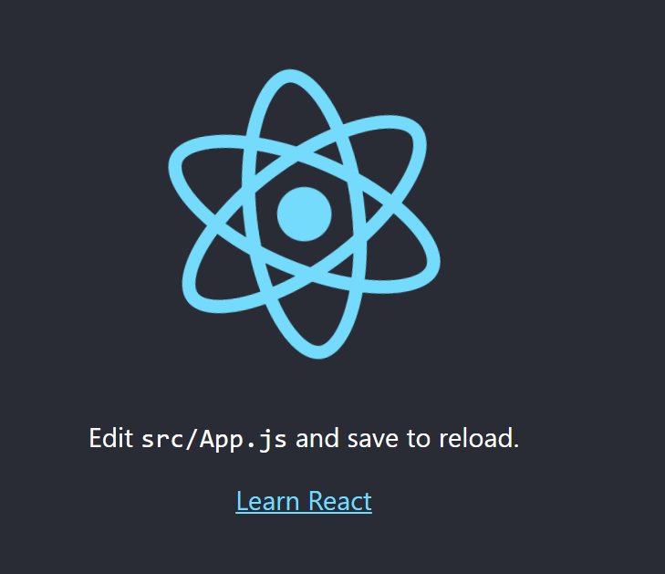

## Integrate React and Django

We'll restart from the end of the [last tutorial](https://github.com/antunesdq/django-tutorial).

First install node and npm
```
sudo apt install nodejs

sudo apt install npm
```

Then create the app in the root directory
```
npx create-react-app mattdqreactapp
```

Build the app so we have the files we need
```
npm run build
```
Now we change settings.py a bit, we need to change the templates from the templates folder to react directory.

```python
TEMPLATES = [
    {
        'BACKEND': 'django.template.backends.django.DjangoTemplates',
        'DIRS': [os.path.join(BASE_DIR, 'mattdqreactapp/build')],
        'APP_DIRS': True,
        'OPTIONS': {
            'context_processors': [
                'django.template.context_processors.debug',
                'django.template.context_processors.request',
                'django.contrib.auth.context_processors.auth',
                'django.contrib.messages.context_processors.messages',
            ],
        },
    },
]
```

Still in settings.py, link the static files:
```python
STATICFILES_DIRS = [
    os.path.join(BASE_DIR, 'mattdqreactapp/build/static')
]
```

Now change urls.py so now it imports Template view, it should look like this with some other changes:
```python
from django.contrib import admin
from django.urls import re_path, include
from django.views.generic import TemplateView

urlpatterns = [
    re_path('admin/', admin.site.urls),
    re_path(r'', TemplateView.as_view(template_name='index.html'))
]
```

Run it with 
```bash
python3 manage.py runserver 0.0.0.0:8000
```

You should see something like this:



Congratulations, you've done it!